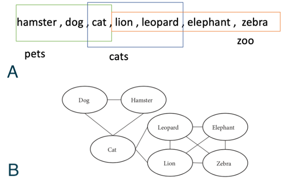
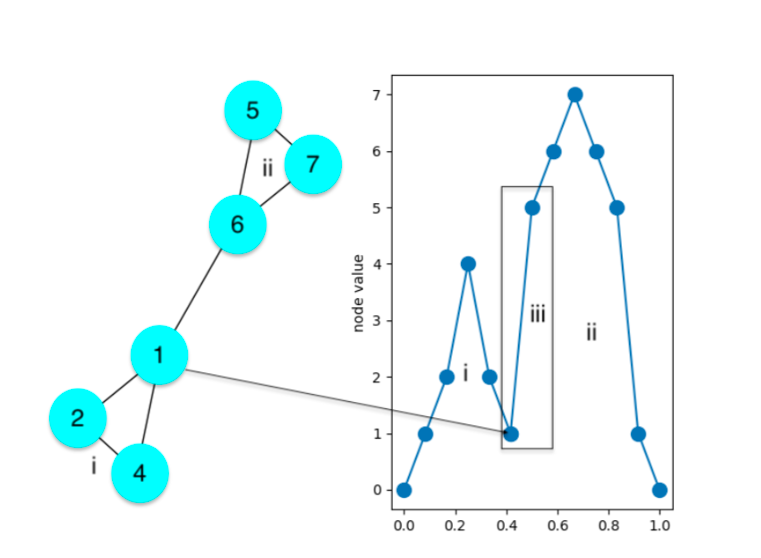
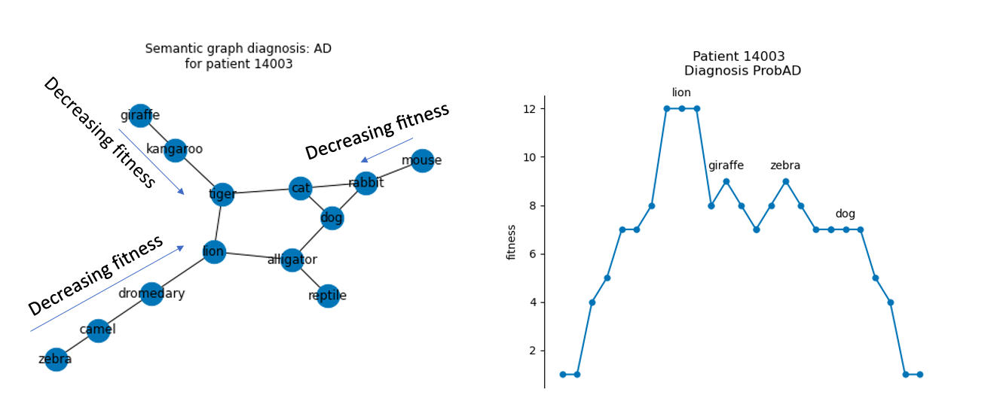

# Visualization of Semantic Networks to Understand Alzheimers Disease

By: Bryce Johnson 

**bcjohnson7@wisc.edu**

Course project for CS841 : Cognitive Psychology and AI

 

Abstract : Semantic networks have been shown to offer insights into the early detection and understanding of the neurological processes of Alzheimer's Disease (AD). However, interpretable visual analysis of these networks has previously been intractable due to the inability to visualize complex networks on a 2D plane. In this work I consider three possible ways (traditional methods, UMAP, and topological analysis) to alleviate this bottleneck. Of the three, topological analysis performs the best as a low fidelity visualization for quick interpretation of large networks. Since the topological analysis is highly dependent on a continuous node "fitness", three possible fitness functions: fluency list order, word frequency, and a combination of the two are studied. Fluency list order fitness is determined as the best representation for semantic networks since it does the best at displaying clusters. Differences in the topology of AD and NC network structure are also discussed and an insight into the neurological processes that causes AD is proposed.

To run the code make a conda environment with the following specifications

`networkx=2.6.3,python=3.9.11,nltk=3.7,numpy =1.21.*, pandas =1.4.* , umap-learn=0.5.3 (pypi) ,tqdm=4.64.* (conda-forge), wordfreq=3.0.1 (pypi),matplotlib=3.5.* `

The `traditional_and_umap.ipynb` file shows all the visualizations for traditional algorithms such as spring and circle layouts. The `cs841.py` file is contains the functions necessary to run the topological analysis. 

===========================================

To run one of the fitness functions from the paper use the `fitness_func_library`. If you wish to run your own fitness function, please contact the author, as this is extremely unstable as of 5/11/2022.

Or 

simply message me and I can zoom with you Joe to show you the outputs. 

===========================================

The final paper for the project is shown in `final_paper.pdf`. 
